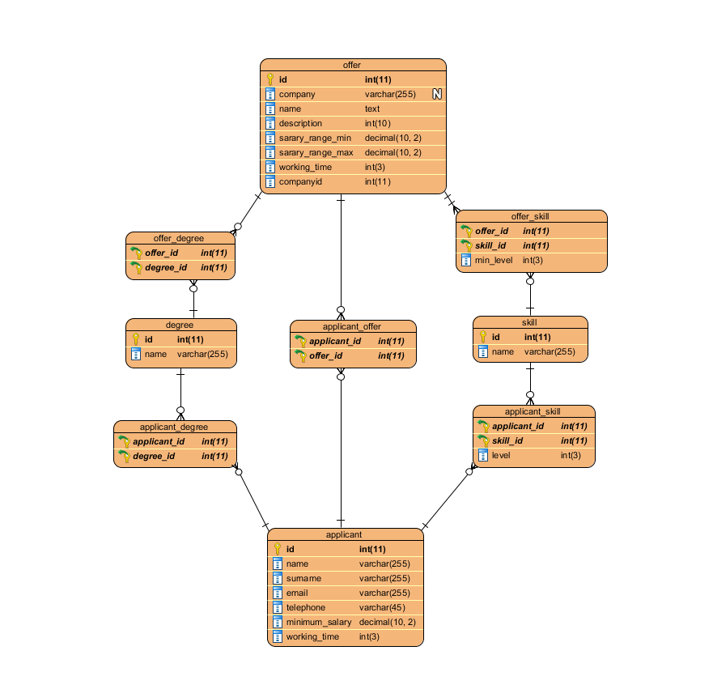

# PeopleWare

## Overview

Small project for testing and learning Spring + Hibernate

## Incomplete tasks

Connecting Applicant with Offer

It’s very easy to do, just using the pivot table applicant_offer like we used to link applicant and offer to degree or skill. We also need some logic in the controller to check if an applicant has the minimum skills and degree to apply for the offer

Present the list of candidates for each job offer based on suitability

That was the most interesting feature of the test, but sadly I didn’t have the time to do it. It’s also really easy to do. Just create a @RequestMapping in the controller with the logic. That function will evaluate all the candidates with a number and keep the top five displaying them in a view.

Skill level. To implement that I have to save that number in the pivot tables "applicant_skill" and “offer_skill” whom connect “skill” table with “applicant” and “offer”. I couldn't figure out how to do it.

It also remains for me to do some simple views and javascript validation

## Database

